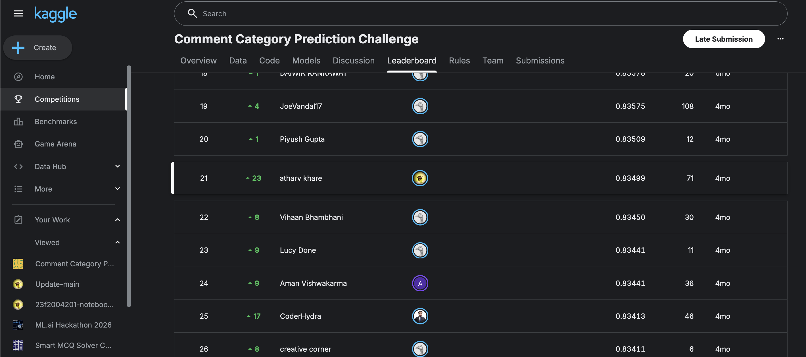
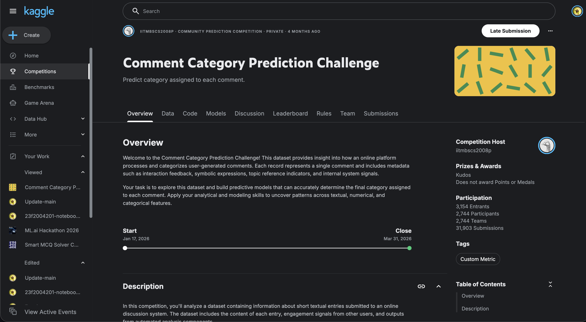

# Comment Category Prediction: Top 0.8% (Rank 21 / 2,744) with Classical ML Only

Multi-class comment-toxicity classification on a severely imbalanced, obfuscated text dataset: **0.835 macro F1** (rank 21 of 2,744 participants) using a stacked ensemble of gradient-boosted trees and linear/Bayesian text models, no deep learning.

- **Competition:** [Comment Category Prediction Challenge](https://www.kaggle.com/competitions/comment-category-prediction-challenge/overview) (Kaggle, private community competition for IIT Madras students)
- **Result:** Rank **21 / 2,744** participants (3,154 entrants), top **0.8%**, score **0.83499** (macro-F1-based custom metric)
- **Stack:** scikit-learn (Logistic Regression, LinearSVC, ComplementNB), LightGBM, engineered features, no deep learning involved



---

## Problem / Dataset

The task: predict the final moderation `label` (0–3) assigned to a short user comment on a discussion platform, given:

- **Text:** the raw `comment`
- **Engagement signals:** `upvote`, `downvote`, `emoticon_1/2/3`
- **Opaque platform signals:** `if_1`, `if_2`: undocumented internal scores computed by the platform's own moderation system
- **Topic/identity flags:** `race`, `religion`, `gender`, `disability`: booleans/categoricals indicating whether the system detected references to these topics
- **Metadata:** `post_id`, `created_date`

Four target classes, heavily imbalanced, roughly:

| Class | Interpretation (inferred from EDA) | Approx. share |
|---|---|---|
| 0 | Normal | ~50% |
| 1 | Offensive / identity-targeted | minority |
| 2 | Hate speech / toxicity | ~40% |
| 3 | Severe / violent threats | ~2.8% (smallest) |

The text itself contains **obfuscated toxic language** (leet-speak substitutions such as `k1ll`, `d34d`, `h4te`, `$t@b`, deliberately used to dodge naive keyword filters), which is the core NLP challenge on top of the class imbalance.

## My Approach

### 1. Text cleaning (obfuscation handling)
Order matters here: obfuscation decoding has to happen **before** non-alphabetic characters are stripped, otherwise the substituted digits/symbols are destroyed along with the noise:

1. Lowercase
2. Strip URLs / HTML tags
3. **Leet-speak decode** (`0→o, 1→i, 3→e, 4→a, 5→s, 7→t, @→a, $→s, !→i`) while digits/symbols still exist
4. Expand common abbreviations (`kys` → "kill yourself", `wtf` → "what the fuck", etc.)
5. Strip remaining non-alphabetic characters, collapse whitespace

### 2. Feature engineering
~53 hand-crafted numeric features, validated by enrichment ratio / mutual information / Kruskal-Wallis before inclusion (features below a ~2× class-enrichment threshold were dropped):

- **Text complexity:** word/char counts, lexical diversity, capitalization ratio
- **Violence lexicon:** `violence_count`, `violence_ratio`, `short_violent` (short comment + violent word combo; strong Class-3 signal, ~8x enrichment)
- **Sentiment lexicon:** hand-built positive/negative word-count features
- **Platform "zone" features:** `if_1 × if_2` interaction terms (`if_prod`, `if_ratio`, `zone_safe`, `golden_c1`): these turned out to be the single strongest signal in the dataset (Kruskal-Wallis H > 20,000), because the platform's own opaque moderation score is itself a distillation of many hidden signals
- **Identity reference flags:** derived from `race`/`religion`/`gender`, kept as their own category rather than collapsing `NaN` and `"none"` together: a user explicitly selecting "none" behaves differently from one who left the field blank
- **Temporal:** cyclical hour-of-day encoding (`sin`/`cos`), weekend flag; weak but free signal
- **Engagement:** vote ratio, controversy score

Text itself is represented with **three complementary TF-IDF spaces**, concatenated into one sparse matrix:
- Word-level (1–2 grams): general vocabulary/semantics
- **Character-level (char_wb, 3–5 grams)**: the main defense against obfuscation; catches `k1ll`/`kill` as near-identical patterns even after imperfect leet-decoding
- Phrase-level (2–3 grams): multi-word toxic phrases (`"kill yourself"`)

### 3. Imbalance handling
- Per-class weights in LightGBM (`{0: 1.0, 1: 3.5, 2: 1.5, 3: 15.0}`): tuned rather than derived directly from the raw imbalance ratio, to balance precision/recall rather than just oversampling the loss on the rarest class
- `class_weight='balanced'` on all linear/SVM baselines
- **Post-hoc per-class threshold multipliers**, tuned via Nelder-Mead, applied to the final probability vector before `argmax`: the meta-model systematically under-predicted the ~2.8%-share Class 3 even after class weighting, so thresholds were loosened specifically for it (bounded search space to avoid overfitting the multipliers themselves)

### 4. Models & validation
Seven base models, each trained under **Stratified K-Fold CV** to produce leakage-free out-of-fold (OOF) predictions:

| Model | Input | Role |
|---|---|---|
| LightGBM (multiclass) | Full feature matrix (TF-IDF + engineered + categorical) | Primary model; handles non-linear interactions natively |
| Logistic Regression (word n-grams) | Word TF-IDF | Fast, diverse baseline |
| Logistic Regression (char n-grams) | Char TF-IDF | Obfuscation-robust linear view |
| NB-SVM | Word TF-IDF × NB log-count ratio | Bayesian-weighted linear model (Wang & Manning, 2012) |
| LightGBM (Class-3-vs-rest) | Full feature matrix | Specialist binary detector for the rarest class |
| LightGBM (Class-3-vs-Class-2) | Full feature matrix | Specialist for the hardest pairwise confusion |
| Calibrated LinearSVC | Word TF-IDF | Max-margin diversity, probability-calibrated |

Hyperparameters (LightGBM `num_leaves`, `colsample_bytree`, learning rate; LR/SVC `C`) were tuned via `RandomizedSearchCV`/`GridSearchCV` against macro-F1 on held-out folds.

### 5. Ensembling
The 7 base models' OOF probability outputs are concatenated into a 24-column matrix and fed into a **shallow LightGBM meta-learner**, trained with its own 5-fold CV: this beat a Logistic Regression meta-learner in internal validation (0.834 vs 0.830 OOF macro F1). A meta-learner was preferred over simple averaging because it learns *which base model to trust per class*, rather than treating all seven as equally reliable everywhere.

## Results

| Stage | Macro F1 (internal OOF) |
|---|---|
| Best single base model (tuned LightGBM) | ~0.82 |
| Stacked meta-learner (before threshold tuning) | ~0.834 |
| **Final (meta-learner + per-class thresholds)** | **~0.835** |
| **Official leaderboard score** | **0.83499 (rank 21 / 2,744, top 0.8%)** |




Class 3 (severe/violent, ~2.8% of data) was the consistent bottleneck across every model: the smallest class, with the least identity-based signal to lean on, and the one requiring the largest threshold correction.

## What I Learned / Key Insights

- **The platform's own opaque signals (`if_1`, `if_2`) were the single strongest predictor**, stronger than any hand-built lexicon feature. Sometimes the most valuable feature engineering is recognizing and properly encoding a signal you didn't build, rather than building a better one from scratch.
- **Obfuscation handling is an ordering problem, not just a mapping problem.** Decoding leet-speak before stripping symbols (and backing it up with character n-grams as a safety net) mattered more than the sophistication of the substitution table itself.
- **A shallow meta-learner beat naive averaging** by learning per-class trust across a diverse set of 7 base models. Diversity (linear, Bayesian, tree-based, specialist binary classifiers) mattered more than any single model's raw strength.
- **Fixing class imbalance is not one lever.** Class weights, stratified CV, and post-hoc threshold tuning each fixed a different failure mode; none of them alone was sufficient for the rarest class.
- **Classical ML remained fully competitive** on this task: the signal lived in engineered platform-interaction features and TF-IDF text representations, not in representations that would obviously benefit from a transformer.

## Reproducibility Note

This repo does not include competition data or the notebook I actually submitted (see below). The `src/` skeleton illustrates the pipeline structure (cleaning → feature engineering → TF-IDF → stacked ensemble) but is a **simplified, independently rewritten reference implementation**, not a drop-in reproduction. To reproduce meaningfully you would need:
- The original `train.csv`/`test.csv` (not published here; see Kaggle competition page, which may no longer be publicly accessible since this was a private competition)
- The full hand-tuned hyperparameter grids (only final chosen values are illustrated in `src/train.py`)
- The exact per-class threshold multipliers, which were fit once via Nelder-Mead on this specific dataset and would not transfer directly to another

## Note on Code Availability

This was a **private, competition-only Kaggle notebook** (course-hosted community competition, closed since March 2026). Kaggle's rules for private competitions mean the original submission notebook is not mine to freely redistribute, and this repo does not include it. What's here instead:

- An honest description of the methodology actually used (above), reconstructed directly from my own notebook
- An **independently rewritten**, simplified illustrative version of the pipeline in `src/`, containing no competition data and no verbatim competition code
- [`Notebook-main.ipynb`](Notebook-main.ipynb): a reconstructed copy of my approach, written after the fact. This is not the notebook I actually submitted to the competition, but a recreated version of it
- Leaderboard/result screenshots as evidence of the outcome, not the process

## Deployment & Interactive Web UI Dashboard

- **Production Training Notebook:** [`app/deployment_training_fast.ipynb`](app/deployment_training_fast.ipynb)
  Kaggle notebook containing the exact 7-model stacked ensemble pipeline, feature engineering, vectorization, meta-learner, and threshold multipliers, tuned to fit Kaggle's CPU time limit. Each base learner's `N_FOLDS` cross-validation copies are kept and bagged (averaged) at inference time instead of doing a separate full-data refit. When executed on Kaggle, it exports all fitted fold models to a compressed `comment_classifier_pipeline.joblib` artifact matching the schema `app/app.py` expects.
- **Hugging Face Space Web App:** [`app/app.py`](app/app.py)
  Interactive real-time Comment Toxicity & Category Intelligence Dashboard built with Gradio. Features live classification, class probability progress gauges, linguistic token signals (leet-speak decodings, violent/negative lexicons), sentiment balance scores, and test sample presets. Runs in a heuristic "Demonstration Preview Mode" until `comment_classifier_pipeline.joblib` is placed alongside it.

```bash
# Run Web UI locally
cd app
pip install -r requirements.txt
python app.py
```

## Stack

`numpy` · `pandas` · `scikit-learn` · `lightgbm` · `joblib` · `gradio`

See [requirements.txt](requirements.txt) and [app/requirements.txt](app/requirements.txt).

